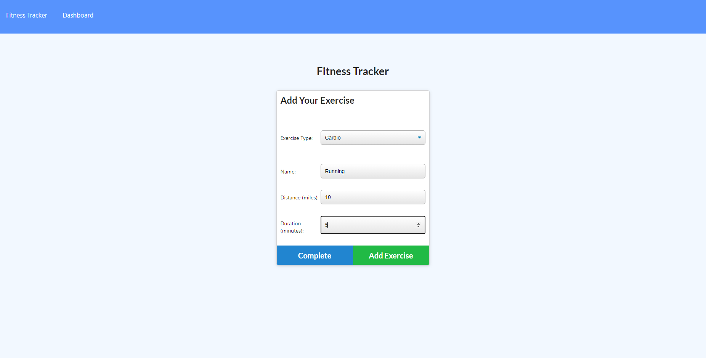
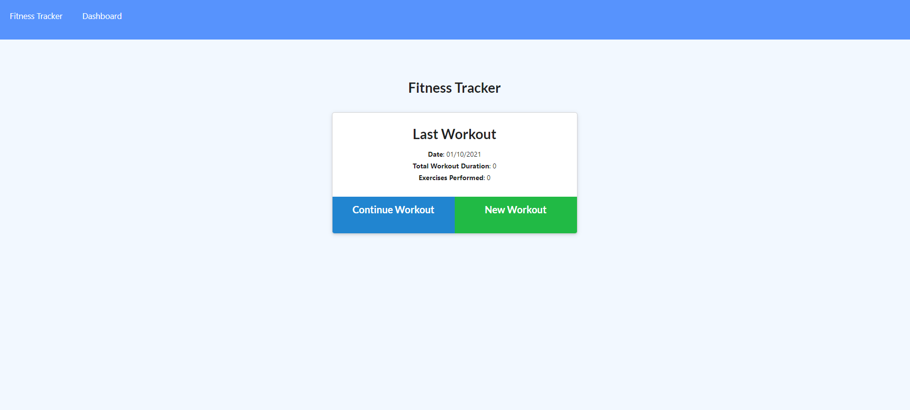

# Unit 18 Nosql Homework: Workout Tracker

This is a fitness tracker, where users can add their workouts and track their progress using a dashboard. The application was created using a Mongo database with a Mongoose schema and handle routes with Express. The application is deployed using Heroku and MongoDB Atlas.

## Technologies used
* MongoDB
* Mongoose
* Express
* Heroku

## Installation

1. Clone repo
2. Run npm install
3. To start the server, run the command 'npm start'

## User Story

* As a user, I want to be able to view create and track daily workouts. I want to be able to log multiple exercises in a workout on a given day. I should also be able to track the name, type, weight, sets, reps, and duration of exercise. If the exercise is a cardio exercise, I should be able to track my distance traveled.

## Acceptance Criteria

When the user loads the page, they should be given the option to create a new workout or continue with their last workout.

The user should be able to:

  * Add exercises to the most recent workout plan.

  * Add new exercises to a new workout plan.

  * View the combined weight of multiple exercises from the past seven workouts on the `stats` page.

  * View the total duration of each workout from the past seven workouts on the `stats` page.

  ## Deployed site
  
  

  ### Link
  [Fitness Tracker](https://exercisetracker12345.herokuapp.com/) - deployed on Heroku

## Licenses
MIT
